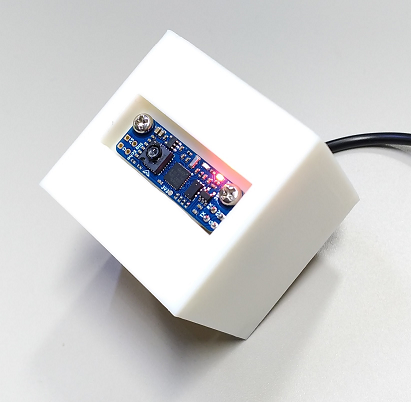

# 3DSensorExperiment
3D Sensor experiment with drone sensor product of "Matek Optical Flow &amp; Lidar Sensor 3901-L0X"

Target product  
  
  
Add solder DIP  
  
  
Take transrate USB-TTL serial  
  
  
Attache 3d-printed boxs .STL file  
  
  
Moving sensor  
  
  
